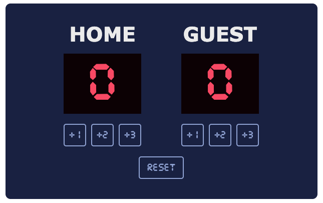

# 🏀 Basketball Scoreboard  

This project is a **practice exercise in HTML, CSS, and JavaScript**.  
The goal was to recreate a simple basketball scoreboard based on a design from Figma and bring it to life with interactive features.  

---

## 🎯 Focus of the Exercise  
- Structuring the layout using **semantic HTML**  
- Practicing **Flexbox** for alignment and spacing  
- Styling with custom fonts and colors to match the design  
- Adding **interactivity with JavaScript**, including:  
  - Incrementing points for *Home* and *Guest* teams (+1, +2, +3)  
  - Resetting the scoreboard to `0 - 0`  

---

## 🧠 What I Learned  
- How to connect **HTML, CSS, and JavaScript** in a single project  
- The relationship between containers and child elements in **Flexbox**  
- How CSS properties like `gap`, `justify-content`, and `align-items` control layout  
- How to use **DOM manipulation** (`getElementById`, `.textContent`) to update scores dynamically  
- The importance of small layout adjustments (margins, paddings) to match a design precisely  

---
⚠️ **Note:** This project was created for practice only.  
It does not include **responsiveness** (mobile or tablet optimization).  

---

## 🚀 Live Demo  
🔗 [See it live on Netlify](https://scoreboard-scrimba-project-pstroka.netlify.app/)  

---

## 🖼️ Screenshot  
  
